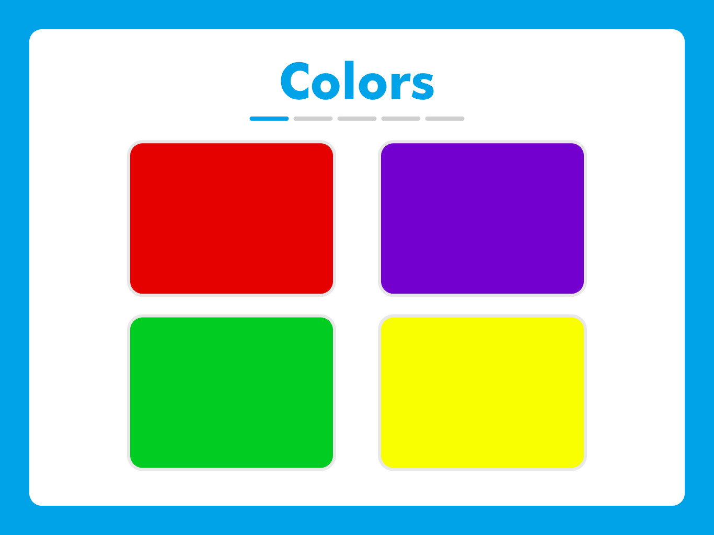
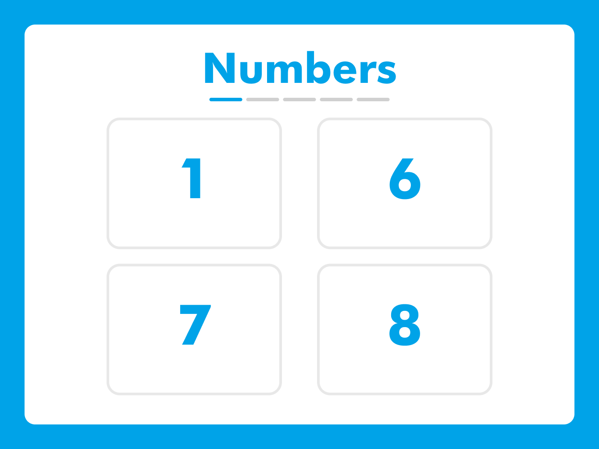
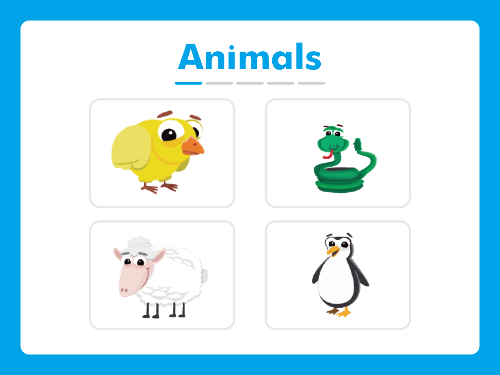

# Learnly

---

## Description
Learnly (from Learn Early) is an app for Early Learning. The kids can go through a series of quizzes and their parents can see their results and manage them in a separate app, named My Learnlies.

#### Learnly Children Screen

#### My Learnlies Home Screen / My Learnlies Add a Child Screen

| Home Screen                                                        | Child Screen                                                 |
|--------------------------------------------------------------------|--------------------------------------------------------------|
|  |  |

### Learnly Examples of Quizzes
The app facilitates easy access to the quizzes and an intuitive interface for children.
They can hear the prompt and whenever they select an answer, they get feedback on what they selected.

#### Colors

#### Numbers

#### Images

### Parental Management
Parents can switch contexts through a Netflix style page. They can do this after login / from settings.

#### Learnly Settings

#### Learnly Parental Guard
To make sure the kids can't change this context, there's a parental guard in place that contains a problem that must be solved. Usually, children can't solve it.

## Figma
Here's the [Figma](https://www.figma.com/file/2rzjrDoRchqEoSpiS7wTuG/UniHack---Learnly-%26-MyLearnlies?type=design&node-id=0%3A1&mode=design&t=UG7Bv9qhk8Aj6o2C-1) mockup for the implemented app.

## Team members
+ [Gabriela Butnaru](https://github.com/gabrielabutnaru)
+ [Dana Câmpan](https://github.com/danacampan)
+ [Damian-Teodor Beleș](https://github.com/damianbeles)
